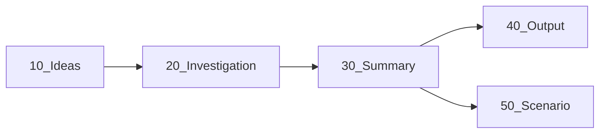

# Knowledge Vault - Claude Code 運用ガイド
このリポジトリは Obsidian Vault です。ナレッジの蓄積からアウトプットまでをお管理します。

## フォルダの役割
```
10_Ideas/             : アイディアの種。1ファイル1テーマ。未調査の状態。
20_Investigation/     : 調査の実施場所。一次情報・出典を出す。
30_Summary/           : 調査を構造化したまとめ。再利用可能なナレッジ。
40_Output/            : 公開用記事。
50_Scenario/          : 動画台本。
81_Daily/             : 日時メモ。
82_Weekly/            : 週時レビュー
83_Monthly/           : 月時レビュー
```

## ワークフロー


## 全ノート共通ルール
- ファイル名は `YYYY-MM-DD_短いタイトル.md`。
- 冒頭に YAML frontmatter（`title / created / updated / status / tags / source / related`）を必ず付ける。
- `status` は `idea | investigating | summarized | draft | published` のいずれか。
- ノート間は `[[ウィキリンク]]` で必ず関連付ける。一方向で終わらせず逆リンクも張る。
- タグは `#status/種別` と `#topic/分野` の形式。
- 出典・URLは本文末尾の「## 参照」にまとめる。
- 既存ノートを編集するときは、関連する他フォルダのノートを Grep で探してリンクする。

## 禁止事項
- 素材ノートにない事実・数字を後工程で創作しない。必要なら調査に差し戻す。
- frontmatter とテンプレの見出し構成を崩さない（Dataview と横断検索の前提）。